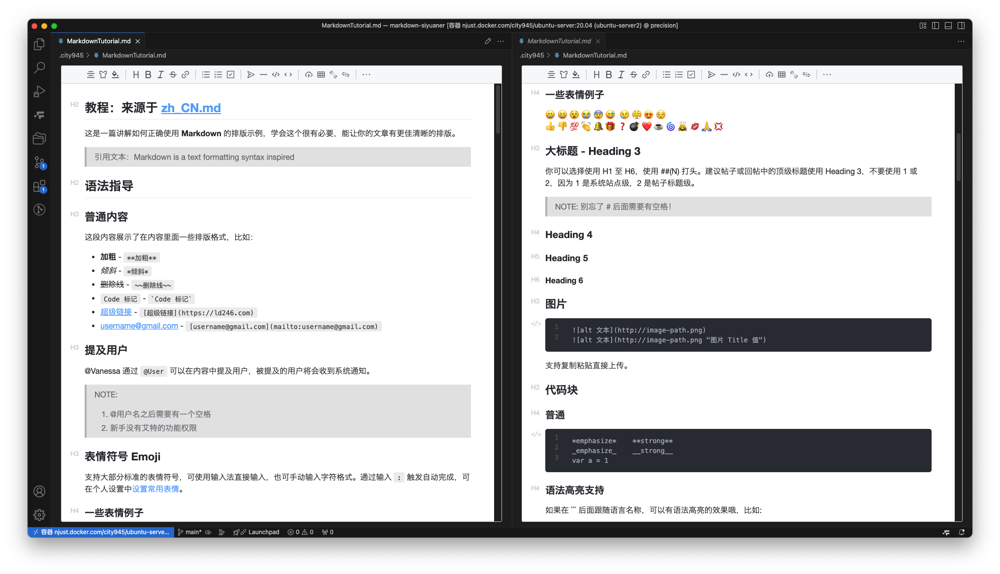
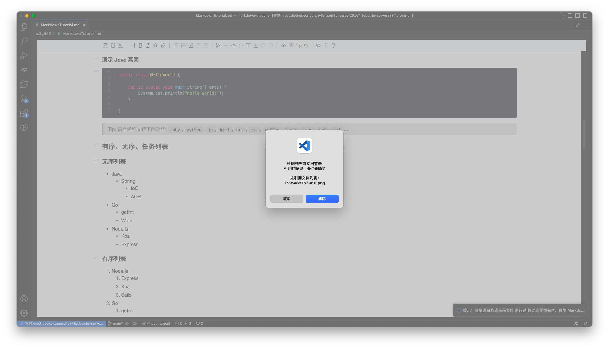

# VSCode Markdown SiYuaner

 

一名思源笔记用户的自用 VSCode Markdown 插件，欢迎大家尝试哦。

本插件基于 [Vditor](https://github.com/Vanessa219/vditor) 实现，修复在 VSCode 下打开链接、纯文本粘贴等功能的错误，新增宽屏模式、修复文档链接等功能。此外插件部分的代码非常简单，代码提交历史简洁，非前端开发者也能快速上手学习和复现。

### 快速演示





### 安装

```bash
npm install
npm run build
# F5 启动调试，打开带 md 文件的文件夹
npm run package # 打包插件
```

### 常见问题

- 快捷键查看 [Vditor shortcuts](https://ld246.com/article/1582778815353)
- 目前仅对 "light" 主题支持较好
- Vditor 粘贴 Markdown 代码时对代码块的渲染会出错，可以先点击标签页右侧 "笔" 图标，切换到默认编辑器再粘贴，再点击该按钮切回，切回时才触发文档更新
- 如何自定义资源目录: 打开用户设置(JSON)，修改变量 "markdown-siyuaner.assetsPath" 的值，`${documentFolder}/assets` 则在当前文档目录下新建资源目录 assets，`${workspaceFolder}/.../assets` 则在当前工作区的指定目录下新建资源目录
- 关于修复文档链接功能
  - 当移动文档路径、移动或重命名整个资源目录、移动或重命名当前文档资源目录时，链接失效，均可一键根据提示修复链接
  - 当用户重命名文档时，链接有效，但会导致原来的资源文件失去管理，故最好同时重命名文档的资源目录名，否则可以移动原来的文档资源到新的文档资源目录下，点击修复链接
  - 清除未引用文件: 图片路径中必须带有所属文档信息，要么是 fileName/now.png 要么是 fileName_now.png 否则没法判断图片所属文档则没法实现删除未引用图片的功能，选择前者因为便于用户手动管理

### 致谢

代码主要参考 [vscode-office](https://github.com/cweijan/vscode-office) 和 [Vditor](https://github.com/Vanessa219/vditor) 实现，感谢这些开发者的无私贡献！
